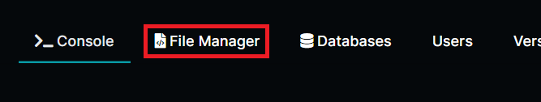

# Discord.JS Sürüm Değiştirme

Discord.JS sürümünü değiştirmek için öncelikle "File Manager" kısmına geliyoruz.\
\
\
Package.json dosyasını bulup üstüne tıklayalım.\
.png>)\
\
Discord.js yazan yerin ön kısmına istediğimiz [sürümü ](https://www.npmjs.com/package/discord.js?activeTab=versions)yazalım.\
\
.png>)\
\
"Save Content" kısmına basıp kaydedelim.\
\
.png>)
